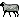
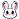

# Original MSN Emoticons

All **76** *(+ 5 unused)* original emoticons from the **Microsoft Live Messenger**.

|                                                                       | Name                    | Shortcut | Filename                  | Animated |
|-----------------------------------------------------------------------|-------------------------|----------|---------------------------|----------|
|                                        | Smile                   | `:)`     | `smile`                   | No       |
|              | Open-mouthed smile      | `:D`     | `open-mouthed-smile`      | No       |
|                        | Winking smile           | `;)`     | `winking-smile`           | Yes      |
|                   | Surprised smile         | `:-O`    | `surprised-smile`         | No       |
|        | Smile with tongue out   | `:P`     | `smile-with-tongue-out`   | No       |
|                               | Hot smile               | `(H)`    | `hot-smile`               | No       |
|                            | Angry smile             | `:@`     | `angry-smile`             | No       |
|                | Embarrassed smile       | `:$`     | `embarrassed-smile`       | No       |
|                      | Confused smile          | `:S`     | `confused-smile`          | No       |
|                                | Sad smile               | `:(`     | `sad-smile`               | No       |
|                           | Crying face             | `:'(`    | `crying-face`             | Yes      |
|             | Disappointed smile      | `:\|`    | `disappointed-smile`      | No       |
|                                       | Devil                   | `(6)`    | `devil`                   | No       |
|                                       | Angel                   | `(A)`    | `angel`                   | No       |
|                               | Red heart               | `(L)`    | `red-heart`               | No       |
|                         | Broken heart            | `(U)`    | `broken-heart`            | No       |
|                               | Messenger               | `(M)`    | `messenger`               | No       |
|                                 | Cat face                | `(@)`    | `cat-face`                | No       |
|                                 | Dog face                | `(&)`    | `dog-face`                | No       |
|             | Sleeping half-moon      | `(S)`    | `sleeping-half-moon`      | No       |
|                                         | Star                    | `(*)`    | `star`                    | No       |
|                               | Filmstrip               | `(~)`    | `filmstrip`               | No       |
|                                         | Note                    | `(8)`    | `note`                    | No       |
|                                     | E-mail                  | `(E)`    | `e-mail`                  | No       |
|                                 | Red rose                | `(F)`    | `red-rose`                | No       |
|                           | Wilted rose             | `(W)`    | `wilted-rose`             | No       |
|                                       | Clock                   | `(O)`    | `clock`                   | No       |
|                                 | Red lips                | `(K)`    | `red-lips`                | No       |
|                   | Gift with a bow         | `(G)`    | `gift-with-a-bow`         | No       |
|                       | Birthday cake           | `(^)`    | `birthday-cake`           | Yes      |
|                                     | Camera                  | `(P)`    | `camera`                  | No       |
|                             | Light bulb              | `(I)`    | `light-bulb`              | No       |
|                             | Coffee cup              | `(C)`    | `coffee-cup`              | No       |
|             | Telephone receiver      | `(T)`    | `telephone-receiver`      | No       |
|                                 | Left hug                | `({)`    | `left-hug`                | No       |
|                               | Right hug               | `(})`    | `right-hug`               | No       |
|                                 | Beer mug                | `(B)`    | `beer-mug`                | No       |
|                       | Martini glass           | `(D)`    | `martini-glass`           | No       |
|                                           | Boy                     | `(Z)`    | `boy`                     | No       |
|                                         | Girl                    | `(X)`    | `girl`                    | No       |
|                               | Thumbs up               | `(Y)`    | `thumbs-up`               | No       |
|                           | Thumbs down             | `(N)`    | `thumbs-down`             | No       |
|                           | Vampire bat             | `:[`     | `vampire-bat`             | Yes      |
|                                       | Goat                    | `(nnh)`  | `goat`                    | No       |
|                                           | Sun                     | `(#)`    | `sun`                     | No       |
|                                   | Rainbow                 | `(R)`    | `rainbow`                 | No       |
|    | Don't tell anyone smile | `:-#`    | `dont-tell-anyone-smile`  | No       |
|            | Baring teeth smile      | `8o\|`   | `baring-teeth-smile`      | No       |
|                            | Nerd smile              | `8-\|`   | `nerd-smile`              | No       |
|                   | Sarcastic smile         | `^o)`    | `sarcastic-smile`         | No       |
|         | Secret telling smile    | `:-*`    | `secret-telling-smile`    | No       |
|                             | Sick smile              | `+o(`    | `sick-smile`              | No       |
|                                      | Snail                   | `(sn)`   | `snail`                   | No       |
|                                    | Turtle                  | `(tu)`   | `turtle`                  | No       |
|                                      | Plate                   | `(pl)`   | `plate`                   | No       |
|                                      | Bowl                    | `(\|\|)` | `bowl`                    | No       |
|                                      | Pizza                   | `(pi)`   | `pizza`                   | No       |
|                          | Soccer ball             | `(so)`   | `soccer-ball`             | No       |
|                                        | Auto                    | `(au)`   | `auto`                    | No       |
|                                | Airplane                | `(ap)`   | `airplane`                | No       |
|                                | Umbrella                | `(um)`   | `umbrella`                | No       |
|  | Island with a palm tree | `(ip)`   | `island-with-a-palm-tree` | No       |
|                                | Computer                | `(co)`   | `computer`                | No       |
|                        | Mobile phone            | `(mp)`   | `mobile-phone`            | No       |
|                     | Be right back           | `(brb)`  | `be-right-back`           | No       |
|                          | Storm cloud             | `(st)`   | `storm-cloud`             | No       |
|                             | High five!              | `(h5)`   | `high-five`               | No       |
|                                      | Money                   | `(mo)`   | `money`                   | No       |
|                         | Black sheep             | `(bah)`  | `black-sheep`             | No       |
|              | I don't know smile      | `:^)`    | `i-dont-know-smile`       | Yes      |
|                     | Thinking smile          | `*-)`    | `thinking-smile`          | Yes      |
|                              | Lightning               | `(li)`   | `lightning`               | Yes      |
|                          | Party smile             | `<:o)`   | `party-smile`             | Yes      |
|               | Eye-rolling smile       | `8-)`    | `eye-rolling-smile`       | Yes      |
|                        | Sleepy smile            | `\|-)`   | `sleepy-smile`            | Yes      |
|                                     | Bunny                   | `('.')`  | `bunny`                   | No       |

**Unused emoticons**

|                                                         | Name            | Filename                 | Animated |
|---------------------------------------------------------|-----------------|--------------------------|----------|
|            | Headphones      | `unused-headphones`      | No       |
|  | Fingers crossed | `unused-fingers-crossed` | No       |
|              | Cigarette       | `unused-cigarette`       | Yes      |
|                        | Xbox            | `unused-xbox`            | No       |
|                 | Handcuffs[^1]   | `unused-handcuffs`       | No       |

[^1]: Only available in the `retro` directory.

*All emoticons were extracted from [Escargot](https://escargot.chat/) using [Resource Hacker](https://www.angusj.com/resourcehacker/).*

## Animated emoticons

Emoticons marked as **"Animated"** include four versions of themselves:
- `[filename].png` - APNG animated version
- `[filename].gif` - GIF animated version
- `[filename]-static.png` - Static version
- `[filename]-frames.png` - Animation sprite sheet

> [!NOTE]
> 
> It's recommended to use `.png` over `.gif` due to semi-transparent pixels featured in most animated emoticons.
>
> | `.png` | `.gif` |
> |--------|--------|
> |  |  |

## Directories

This repository is divided in the following directories:

- `original` - Every emoticon in it's original resolution. *(19x)*
- `retro` - 8-bit color versions. *(No animated versions.)*
- `source` - Original files with no modifications.